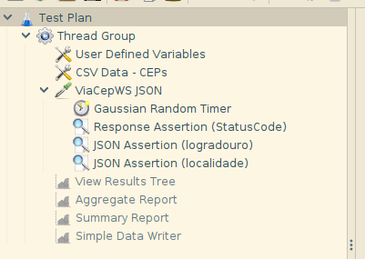

# **Projeto de Testes Não-Funcionais com JMeter**

Olá!

Este é um projeto de testes não-funcionais da API de consulta de CEP da ViaCEP!

Os testes consistem em ler um arquivo .csv com dados de alguns logradouros e, durante 60 segundos, enviar requisições para a API da ViaCEP (mantendo 3 threads) e validar a resposta de cada uma das requisições.

----
_obs: os valores de quantidade de threads e de duração são parametrizáveis =]_

_obs 2: existe um relatório em html dos testes feitos usando esse script, basta abrir o arquivo resultados/web_report/index.html_

----
## **Ferramentas Necessárias**
* [**Java JDK ou JRE 8+**](https://java.com/en/download/help/download_options.html)
* [**JMeter (utilizada versão 5.4.1)**](https://www.blazemeter.com/blog/how-get-started-jmeter-installation-test-plans)
* [**Git Client**](https://git-scm.com/book/pt-br/v2/Come%C3%A7ando-Instalando-o-Git)

----
## **Preparação**
Abra o terminal e faça um clone do projeto:
```
git clone https://github.com/fteixeira471/jmeter_non-functional.git
```
```
cd jmeter_non-functional
```

----
## **Executando os Testes - NonGUI (_Recomendado_)**
https://jmeter.apache.org/usermanual/get-started.html#non_gui

Para executar os testes sem interface gráfica, execute o comando no terminal seguindo o padrão abaixo:
```
[caminho binário do JMeter] -n -t [caminho do arquivo .jmx] -l [caminho e nome do arquivo de log] -e -o [caminho da pasta para armazenar o report em html]
```
Exemplo de uma execução que irá durar 3 minutos, mantendo 6 threads e que irá gerar um report em html:
```
C:\apache-jmeter-5.4.1\bin\jmeter -n -t via_cep.jmx -l resultados\log.jtl -e -o resultados\report_web_01 -Jthreads=6 -Jduration=180
```

----
##### **-Jthreads** e **-Jduration** são parâmetros opcionais. Caso não informados, os valores padrão são 3 threads e 60 segundos de duração

----
## **Executando os Testes - GUI**
##### *(o uso de GUI é recomendado apenas para a criação do script e debugging)*

##### Consulte esse [link](https://jmeter.apache.org/usermanual/get-started.html#running) para mais informações


1. Com a interface do JMeter aberta, carregue o arquivo ***via_cep.jmx*** disponível no projeto
 
2. Habilite os [*listeners*](https://jmeter.apache.org/usermanual/listeners.html) desejados:
```
- View Results Tree
- Aggregate Report
- Summary Report
- Simple Data Writer
```
##### *Simple Data Writer* está configurado para armazenar os arquivos de log .jtl na pasta *resultados* 

3. Clique em  e acompanhe o teste através dos *listeners* que habilitou

----
## **Gerando reports em html a partir de um arquivo de log do JMeter**
A página a seguir contém informações sobre como gerar um report dos testes em formato html:
https://jmeter.apache.org/usermanual/generating-dashboard.html#report